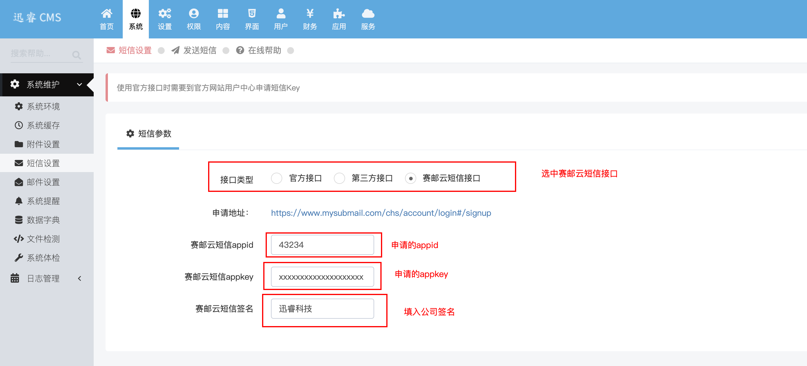

## OVERVIEW

### Xunrui Plug-Ins Overview

>【迅睿cms系统】免费共享开源cms系统,满足各类用户在不同应用场景的需求,是国内免费开源的小程序系统、企业建站源码。
------
迅睿cms系统  [官网地址](https://www.xunruicms.com/)

How to use

-	dayrui/Core/Views/sms_index.html
-	dayrui/Fcms/Model/Member.php

使用方法
    把下载好的迅睿 赛邮云短信插件程序解压覆盖到网站根目录
    找到 系统->短信设置->填入接口

[Github项目地址](https://github.com/submail-developers/xunrui_sms/)&nbsp;&nbsp;&nbsp;[点击下载](https://github.com/submail-developers/xunrui_sms/archive/master.zip)
